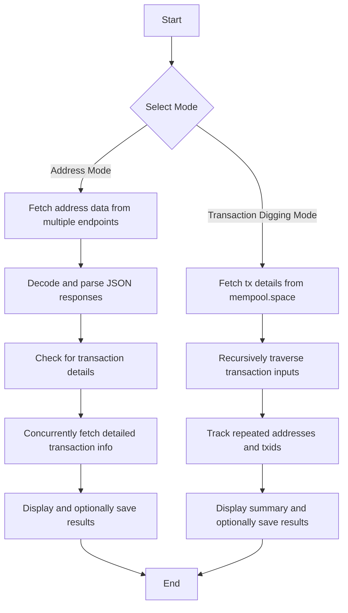

# Advanced Bitcoin Data Explorer and Transaction Digger

An advanced, multi-threaded command-line tool to explore Bitcoin data and recursively analyze transaction chains. This tool leverages multiple API endpoints, rotates HTTP headers to bypass rate limits, and uses concurrent processing for efficient data retrieval and recursive transaction analysis.

---

## Table of Contents

1. [Overview](#overview)
2. [Features](#features)
3. [Dependencies and Installation](#dependencies-and-installation)
4. [Detailed Code Walkthrough](#detailed-code-walkthrough)  
   4.1 [Address Mode](#address-mode)  
   4.2 [Transaction Digging Mode](#transaction-digging-mode)
5. [Architecture and Design](#architecture-and-design)
6. [Flowcharts and Module Diagrams](#flowcharts-and-module-diagrams)
7. [Interactive Animation Simulation](#interactive-animation-simulation)
8. [Usage Instructions](#usage-instructions)
9. [Credits and Acknowledgements](#credits-and-acknowledgements)
10. [Extensibility and Future Enhancements](#extensibility-and-future-enhancements)
11. [Conclusion](#conclusion)

---

## Overview

This command‐line tool provides two principal modes for Bitcoin data analysis:

- **Address Mode:**  
  Retrieve detailed information about a Bitcoin address by querying multiple APIs concurrently. The tool uses endpoints such as blockchain.info, blockcypher, and blockstream.

- **Transaction Digging Mode:**  
  Recursively analyze the inputs of a given transaction up to a user-specified depth. This mode not only shows the flow of funds but also detects and highlights repeated transaction IDs and addresses.

Both modes utilize multi-threading (via Python’s `ThreadPoolExecutor`), rotating HTTP headers, and robust error handling to ensure high performance and resilience.

---

## Features

- **Multi-API Integration (Address Mode)**
  - Queries multiple endpoints for a comprehensive view.
  - Combines responses from blockchain.info, blockcypher, and blockstream.

- **Recursive Transaction Analysis (Transaction Digging Mode)**
  - Traverses transaction inputs recursively.
  - Highlights repeated transaction IDs and addresses.
  - Aggregates summary statistics of addresses and txids.

- **Concurrent Data Fetching & Header Rotation**
  - Uses four distinct `urllib3.PoolManager` instances with unique `User-Agent` headers.
  - Implements a retry mechanism with delays to boost reliability.

- **Thread-Safe Logging & Output**
  - Uses thread locks to ensure clean, non-interleaved console output.

- **Result Persistence**
  - Optionally saves outputs to a dedicated `utxdump/` directory for both address mode and transaction digging mode.

- **Interactive Output Simulation**
  - Includes “play buttons” (via collapsible HTML `<details>` tags) to simulate animated transaction digging logs.

---

## Dependencies and Installation

### Requirements

Ensure you have **Python 3** installed. The tool relies on the following Python packages:
- `argparse`
- `json`
- `os`
- `time`
- `random`
- `threading`
- `concurrent.futures`
- `urllib3`
- `requests`
- `colorama`

### Installation

Install external dependencies with pip:
```bash
pip install requests urllib3 colorama
```

---

## Detailed Code Walkthrough

The source code is organized into two main modes, each with dedicated functions and concurrent processing for optimal performance.

### 1. Address Mode

**Purpose:**  
Fetch comprehensive Bitcoin address data by querying multiple APIs concurrently.

**Key Components:**

- **Multiple API Endpoints:**  
  - **blockchain.info**: Provides both balance and raw address data.
  - **blockcypher**: Supplies additional insights about the address.
  - **blockstream**: Returns further transaction details.

- **Rotating HTTP Headers:**  
  Four separate `urllib3.PoolManager` instances (named `http1` to `http4`) are initialized with unique `User-Agent` headers. This strategy avoids rate limiting and ensures diversity in API requests.

- **Concurrent Fetching:**  
  The `get_address_data` function uses a `ThreadPoolExecutor` to fetch data from each endpoint simultaneously. Responses are then decoded from UTF-8 and parsed as JSON.

- **Transaction Detail Extraction:**  
  If the raw address data (from blockchain.info) contains transactions, the tool concurrently retrieves detailed information for each transaction.

- **Output & Saving:**  
  Results are printed in a structured, color-coded format. Optionally, the output is saved to `utxdump/{address}.log`.

### 2. Transaction Digging Mode

**Purpose:**  
Recursively analyze a transaction’s inputs to trace the flow of funds across previous transactions.

**Key Components:**

- **API Endpoint:**  
  Uses the `mempool.space` API (supports both Bitcoin and Testnet) to retrieve transaction details.

- **Recursive Digging:**  
  The `dig_tx` function recursively explores each transaction’s inputs until a specified maximum level is reached. It aggregates repeated transaction IDs and addresses into a global dictionary.

- **Tracking and Highlighting Repetitions:**  
  Each transaction ID and address is tracked; if detected more than once, it is highlighted in the output.

- **Thread-Safe Output:**  
  Uses a dedicated print lock (`print_lock`) to maintain clean logs.

- **Final Summary and Saving:**  
  Displays a summary of all unique addresses and transaction IDs discovered, with an option to save results to `utxdump/trxids.log`.

---

## Architecture and Design

### Multi-Threading

- **Concurrency:**  
  Utilizes Python’s `ThreadPoolExecutor` to perform multiple API calls in parallel, dramatically reducing overall processing time.

- **Thread Safety:**  
  All console output is managed via a shared lock to prevent overlapping text from concurrent threads.

### Header Rotation

- **Diverse HTTP Requests:**  
  Four `PoolManager` instances with distinct headers distribute API requests, reducing the chance of being blocked by rate limits.

### Recursive Processing

- **Deep Transaction Analysis:**  
  The recursive function (`dig_tx`) enables deep exploration of the transaction chain, ensuring even nested transactions are analyzed.

### Robust Error Handling

- **Resilience:**  
  All network calls are encapsulated in try-except blocks with retries and delays to handle transient network issues gracefully.

### Modularity and Extensibility

- **Easy Enhancements:**  
  The modular design allows you to easily add new APIs or support additional cryptocurrencies. Future improvements, such as a graphical interface, can be integrated with minimal changes to the core code.

---

## Flowcharts and Module Diagrams

Below is a flowchart illustrating the overall operation of the tool.



*Note:* To view this flowchart in rendered form, use a Markdown editor or viewer that supports Mermaid diagrams.

---

## Interactive Animation Simulation

To simulate a real-time animation of the transaction digging process, click the expandable section below:

<details>
  <summary><strong>▶ Play Animation</strong></summary>

  ```
  Starting tx digging mode on network 'bitcoin' for txid a95e587f7ed6813b567c291f91db80785c5e5a3d73f97222f0d3dfcf04e988f3 up to level 2
  Level 0 TX a95e587f7ed6813b567c291f91db80785c5e5a3d73f97222f0d3dfcf04e988f3 has 1 inputs and 1 outputs.
  Inputs:
  adbed3a8ea57bb321ed93a39b5a7ef4424de876a7c2ebb254c82517d6555697e 1875 from bc1qyp8nuqvwfydg9svlm9cgyz3h4krfcrglue786g
  Level 1 TX adbed3a8ea57bb321ed93a39b5a7ef4424de876a7c2ebb254c82517d6555697e has 2 inputs and 2 outputs.
  Inputs:
  5c6dded31f8db448690e7eeb57eb340029335b84f2d5c9bb0475527a1f505f24 3651 from bc1qzc6rjlyrqt6vfp5hjlhwx6nqeahyt4tqe6lcnr
  Detected repeated TX id: 5c6dded31f8db448690e7eeb57eb340029335b84f2d5c9bb0475527a1f505f24
  Detected repeated address: bc1qzc6rjlyrqt6vfp5hjlhwx6nqeahyt4tqe6lcnr
  5c6dded31f8db448690e7eeb57eb340029335b84f2d5c9bb0475527a1f505f24 3685 from bc1qzc6rjlyrqt6vfp5hjlhwx6nqeahyt4tqe6lcnr
  
  ================================================================================
  Total involved addresses: 2
  bc1qyp8nuqvwfydg9svlm9cgyz3h4krfcrglue786g : 1
  bc1qzc6rjlyrqt6vfp5hjlhwx6nqeahyt4tqe6lcnr : 2
  
  Total involved txids: 2
  adbed3a8ea57bb321ed93a39b5a7ef4424de876a7c2ebb254c82517d6555697e : 1
  5c6dded31f8db448690e7eeb57eb340029335b84f2d5c9bb0475527a1f505f24 : 2
  ================================================================================
  ```
</details>

*Note:* These simulated animations use Markdown’s collapsible sections to mimic dynamic output.

---

## Usage Instructions

### Command-Line Arguments

#### Address Mode
To query data for a Bitcoin address:
```bash
./bitcoin_explorer.py -a <Bitcoin_address> [-S]
```
- `-a` or `--address`: Specify the Bitcoin address.
- `-S` or `--save`: Optional flag to save output to a file in `utxdump/`.

#### Transaction Digging Mode
To recursively analyze a transaction:
```bash
./bitcoin_explorer.py [network] <txid> <max_level> [-S]
```
- `network`: Specify the network (`bitcoin` by default; use `testnet` as needed).
- `<txid>`: Starting transaction ID.
- `<max_level>`: Maximum recursion level.
- `-S` or `--save`: Optional flag to save results to `utxdump/`.

### Example Commands

- **Address Mode Example:**
  ```bash
  ./bitcoin_explorer.py -a 1BoatSLRHtKNngkdXEeobR76b53LETtpyT -S
  ```

- **Transaction Digging Mode Example:**
  ```bash
  ./bitcoin_explorer.py bitcoin a95e587f7ed6813b567c291f91db80785c5e5a3d73f97222f0d3dfcf04e988f3 2 -S
  ```

---

## Credits and Acknowledgements

A heartfelt thank you to the incredible projects that inspired and taught me:

- **[utxotrack by albertobsd](https://github.com/albertobsd/utxotrack)**  
  Your innovative approach and clear documentation have been a constant source of inspiration. I truly learned a lot from you guys—from the bottom of my heart, thank you! Your work has significantly shaped my understanding and approach.

---

## Extensibility and Future Enhancements

- **API Integration:**  
  Easily add additional APIs or support for other cryptocurrencies by following the established modular and multi-threaded design.

- **Graphical User Interface (GUI):**  
  Consider building a GUI using frameworks such as Tkinter or PyQt to create an even more interactive user experience.

- **Data Visualization:**  
  Integrate visualization libraries (like Matplotlib or Plotly) to graphically represent transaction flows and network relationships.

- **Advanced Error Handling:**  
  Implement strategies such as exponential backoff and more detailed error logging for enhanced robustness.

---

## Conclusion

This Advanced Bitcoin Data Explorer and Transaction Digger tool provides an in-depth, scalable solution for Bitcoin data analysis. With its robust design—including concurrent processing, intelligent API endpoint rotation, and recursive transaction tracing—it is ideal for professionals and enthusiasts alike.

For contributions, issue reports, or further enhancements, please feel free to open an issue or submit a pull request in the repository.

**Disclaimer:** Please use this tool responsibly and adhere to the terms of service of all third-party APIs.


---

*End of Document*  

---

*This README is licensed under the MIT License. For any questions, issues, or contributions, please visit the GitHub repository at [https://github.com/Shubsaini08](https://github.com/Shubsaini08).*

---

# DOOR'S ARE ALWAYS OPEN FOR DONATIONS  🎯
 
# HOPE IT WILL HELP
[FOR ANY QUESTIONS TEXT US AT]

> MUST VISIT AND JOIN OUR BLOCKCHAIN :: https://t.me/Blythexweb
>
> A WAY AHEAD BLOCKCHAIN THATS SPECIALLY DESIGNED FOR MONITORING HIDDEN TRANSACTIONS 
>
> code_Crusaders0 :: https://t.me/code_Crusaders0
> 
> KEYFOUND ::  https://t.me/privatekeydirectorygroup
> 
> ALSO FOR TRADING WITH BOTS :: https://t.me/+ggaun3gLB900MGY0
> 
> GITHUB LINK FOR MORRE :: https://github.com/Shubsaini08
> 
> KEYFOUND VURTUAL ASSISTANT ::  https://t.me/Shubfind_bot
>
> CODE_CRUSADERS0 VURTUAL ASSISTANT :  https://t.me/Code_Crusaders_bot
>

---

## FOR DONATIONS : 
> 
> CONTACT :: 
>
> US THROUGH DRIECT MESSAGES OR BY MAILING US ::   keyfoundhunt4ever@gmail.com
> 
> OR DIRECT MESSAGE ON TELE : https://t.me/Shainshub
>
> THANK YOU FOR READING THIS DOCUMENTATION
> 

---

HAVE A WONDERFULL DAY STAY BLESSED HOPE YOU WILL HIT SOME(MONEY) SOON......
BYE !!...


